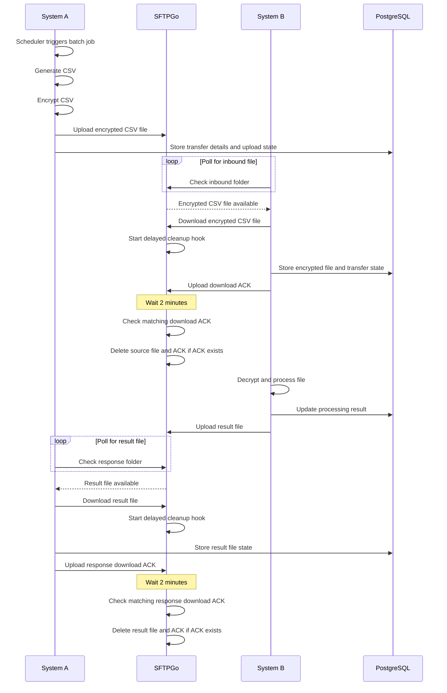

# Detailed Sequence Diagram

```mermaid
sequenceDiagram
    participant A as System A
    participant S as SFTPGo
    participant B as System B
    participant DB as PostgreSQL

    A->>A: Scheduler triggers batch job
    A->>A: Generate CSV
    A->>A: Encrypt CSV
    A->>S: Upload encrypted CSV file
    A->>DB: Store transfer details and upload state

    loop Poll for inbound file
        B->>S: Check inbound folder
    end

    S-->>B: Encrypted CSV file available
    B->>S: Download encrypted CSV file
    S->>S: Start delayed cleanup hook
    B->>DB: Store encrypted file and transfer state
    B->>S: Upload download ACK

    Note over S: Wait 2 minutes
    S->>S: Check matching download ACK
    S->>S: Delete source file and ACK if ACK exists

    B->>B: Decrypt and process file
    B->>DB: Update processing result
    B->>S: Upload result file

    loop Poll for result file
        A->>S: Check response folder
    end

    S-->>A: Result file available
    A->>S: Download result file
    S->>S: Start delayed cleanup hook
    A->>DB: Store result file state
    A->>S: Upload response download ACK

    Note over S: Wait 2 minutes
    S->>S: Check matching response download ACK
    S->>S: Delete result file and ACK if ACK exists
```
