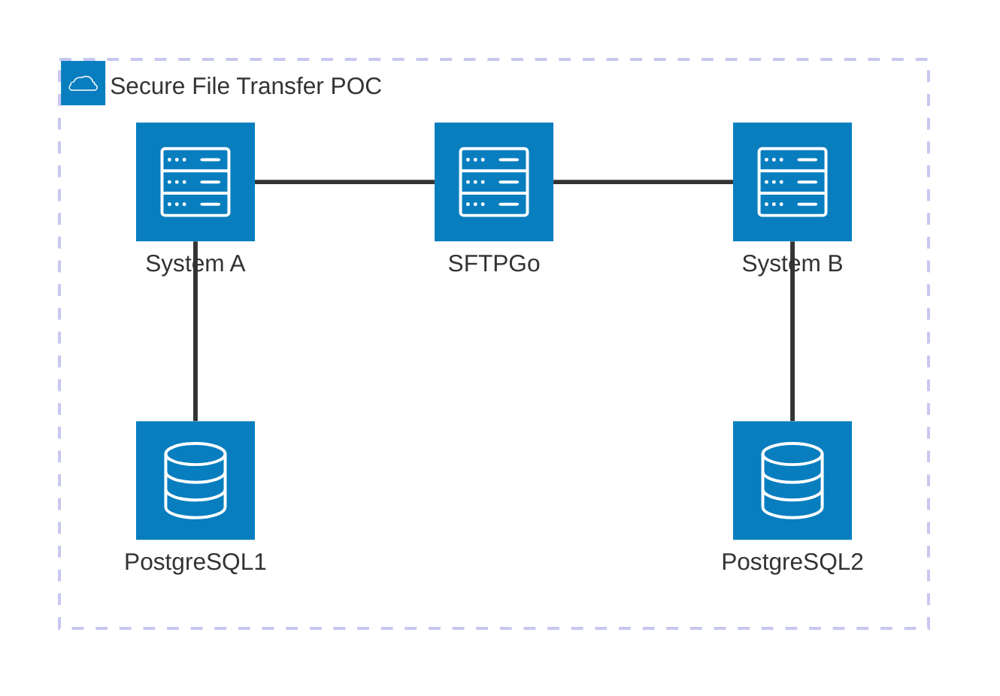

# High-Level Architecture Diagram

```mermaid
architecture-beta
    group poc(cloud)[Secure File Transfer POC]

    service systemA(server)[System A] in poc
    service sftpgo(server)[SFTPGo] in poc
    service systemB(server)[System B] in poc
    service postgres1(database)[PostgreSQL1] in poc
    service postgres2(database)[PostgreSQL2] in poc

    systemA:R -- L:sftpgo
    sftpgo:R -- L:systemB
    systemA:B -- T:postgres1
    systemB:B -- T:postgres2
```
